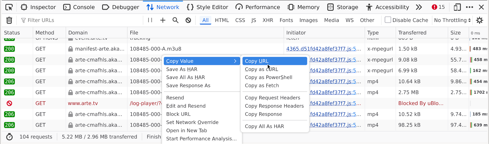
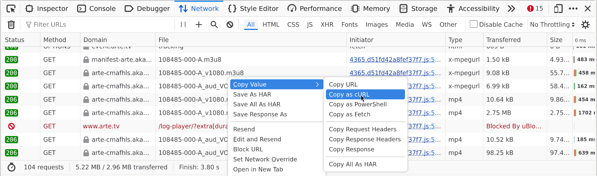

# curl_m3u8

Download media files listed in m3u8-file (via libcurl) and concat them (via ffmpeg).

**curl_m3u8** is a commandline-tool that downloads all the parts of a playlist m3u8-file
given by a URL via the libcurl-library and afterwards concats them via ffmpeg to &lt;NAME&gt;.mp4.

If the downloaded m3u8-file is a master-file containing playlists (e.g. in different quality),
you can select which playlist to use.<br/>
The parts are downloaded in parallel (five at a time) to the **current directory**!
The download-speed is limited to 1 MB/s per file, so 5 MB/s in total.
After all parts are concated via ffmpeg, they are deleted.

[FFmpeg](https://ffmpeg.org/) needs to be installed and available in the path-variable.

## Example

```sh
curl_m3u8 --name <NAME> <URL> to the m3u8-file>
```
This results in &lt;NAME&gt;.mp4 in the current directory.

## Manual

In Firefox (or Chrome) "Copy URL" of the m3u8-file in the Web Developer Tools,

paste it to the console
```sh
curl 'https://arte-cmafhls.akamaized.net/.../108485-000-A_V1080.m3u8'
```
and replace curl with curl\_m3u8 and add a name.
```sh
curl_m3u8 --name fancy_name 'https://arte-cmafhls.akamaized.net/.../108485-000-A_V1080.m3u8'
```
This will result in fancy\_name.m4 in the current directory.

To copy the URL in Firefox go to the Network tab of the Web Developer Tools.
The Web Developer Tools can be found under Tools -> Browser Tools -> Web Developer Tools
or by pressing F12 usually. For Chrome it is similar.

## Development

```sh
cmake .
make
make test
```

In the repo exists unittests and checks. The tests can be run as usually via "make test".
The difference to checks is, that checks need to be verified manually
whereas tests are verified automatically in the test.<br/>
Two checks exist *m3u8_check* and *progressmeter_check*:

* *m3u8_check* parses a m3u8-file (give by commandline) and prints it.
  To verify that m3u8-parsing works.
* *progressmeter_check* simulates some downloads.
  The progressmeter is printed and updated on the way.
  To verify that it looks good and works as expected.

The original idea was in Firefox (or Chrome) to "Copy as cURL" the URL to the m3u8-file
then replace curl with curl\_m3u8 and add a name.<br/>
**But the program is not yet there and propably never will!**<br/>
For this the commandline-parameter need to be passed to libcurl somehow
which probably is not so difficult.


then copy it to the console
```sh
curl 'https://arte-cmafhls.akamaized.net/.../108485-000-A_V1080.m3u8' \
  -H 'User-Agent: Mozilla/5.0 (X11; Linux x86_64; rv:143.0) Gecko/20100101 Firefox/143.0' \
  -H 'Accept: */*' \
  -H 'Accept-Language: en-US,en;q=0.5' \
  -H 'Accept-Encoding: gzip, deflate, br, zstd' \
  ...
```
and replace at the beginning curl with curl\_m3u8 and add a name
```sh
curl_m3u8 --name my_name 'https://arte-cmafhls.akamaized.net/.../108485-000-A_V1080.m3u8' \
  -H 'User-Agent: Mozilla/5.0 (X11; Linux x86_64; rv:143.0) Gecko/20100101 Firefox/143.0' \
  -H 'Accept: */*' \
  -H 'Accept-Language: en-US,en;q=0.5' \
  -H 'Accept-Encoding: gzip, deflate, br, zstd' \
  ...
```
### Dependencies

* libcurl: <https://curl.se/libcurl/>
* GTest: <https://google.github.io/googletest/>

## License

Released under the GNU General Public License v3.0 or later (GPL-3.0-or-later).
See the [LICENSE](LICENSE) file for details.

